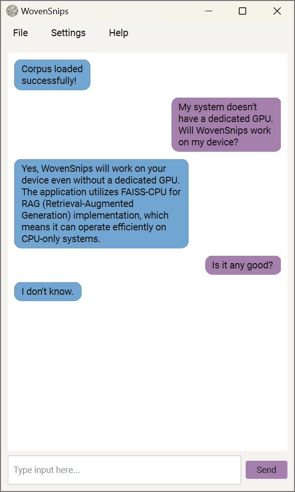
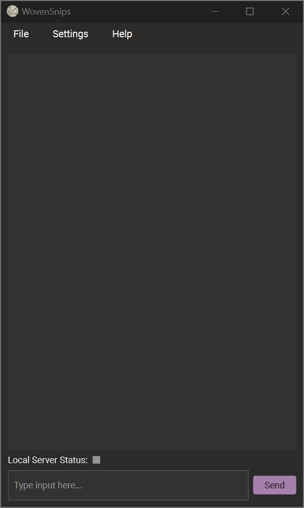

# WovenSnips
     

WovenSnips is a lightweight, free, and open-source implementation of Retrieval-Augmented Generation (RAG) using the [Straico API](https://straico.com/). It provides a simple and clean Graphical User Interface (GUI) for users to load corpora to perform RAG-based explorations of the corpus, mediating the interactions through various language models.

## Features 🌟

- 🔍 Load and process corpora for exploration and context retrieval using Retrieval-Augmented Generation (RAG).
- 🤖 Choose from a wide selection of LLMs provided by Straico.
- 🪶 Designed lightweight to run on devices without a dedicated GPU.
- 💾 Save and load vector stores for efficient reuse of processed corpora.
- 📚 Support for various file formats (.pdf, .txt, .md, .csv).
- 💬 Minimal, user-friendly interface for clutter-free, focused engagement with the loaded corpus.
- 🔌 Local server option to programmatically interact with other applications and scripts.
- 🌓 Dark and light theme options.

  
  

 

## Usage 💻

1. Download the latest release from the [Releases](https://github.com/ekjaisal/WovenSnips/releases) page.
2. Set up WovenSnips on the local device using the installer (currently available only for Windows).
3. Point and click to launch the application.
4. Set the Straico API Key from **Settings → Set API Key**. Existing Straico users can find their API Key from the platform's settings page. New users may choose to create a Straico account using this [referral link](https://platform.straico.com/signup?fpr=jaisal).
5. Select the preferred model to interact with from **Settings → Select Model**.
6. Load the collection of files to be used as source material for RAG from **File → Load Corpus → Select Corpus Directory**, or load a previously saved vector store from **File → Load Vector Store**.
7. Start interacting with the corpus through the main interface.
8. Save the loaded corpus as a vector store for future reuse from **File → Save Vector Store** to avoid reprocessing large corpora.
9. Enable the local server from **Settings → Local Server** to allow [programmatic interaction](https://github.com/ekjaisal/WovenSnips/wiki).

## Third-Party Libraries and Services 🛠️

WovenSnips is built using [Python 3.11.9](https://www.python.org/downloads/release/python-3119) and relies on several modules from the Python Standard Library and the following third-party libraries and services:

- [Straico API](https://straico.com) for language model integration,
- [PySide6](https://pypi.org/project/PySide6) for the graphical user interface,
- [PyTorch](https://github.com/pytorch/pytorch), [NumPy](https://github.com/numpy/numpy), [Langchain](https://pypi.org/project/langchain), [Langchain Community](https://pypi.org/project/langchain-community), [Langchain Hugging Face](https://pypi.org/project/langchain-huggingface), and [FAISS-CPU](https://github.com/kyamagu/faiss-wheels) for RAG implementation,
- [Pydantic](https://github.com/pydantic/pydantic) for data validation,
- [pdfplumber](https://github.com/jsvine/pdfplumber) for processing PDFs,
- [MessagePack](https://github.com/msgpack/msgpack-python) for vector store serialisation,
- [Requests](https://github.com/psf/requests) for API communication,
- [Roboto Font](https://fonts.google.com/specimen/Roboto) for UI typography,
- [PyInstaller](https://pyinstaller.org/) for creating standalone executables, and
- [Inno Setup](https://jrsoftware.org/) for compiling and packaging the installer.

## License 📄

This project is licensed under the BSD 3-Clause License. Please see the [LICENSE](LICENSE) file for details.

## Disclaimer 📣

This tool is provided as-is, without any warranties. Users are responsible for ensuring that their use of this implementation complies with [Straico's terms and conditions](https://straico.com/terms-and-conditions).

## Acknowledgements 🤝🏾

WovenSnips has benefited significantly from the assistance of Anthropic's [Claude 3.5 Sonnet](https://www.anthropic.com/news/claude-3-5-sonnet) with all the heavy lifting associated with coding, [Riley](https://github.com/RoboRiley)'s addition of local server capability, and the overwhelming warmth and support from the Straico community.
